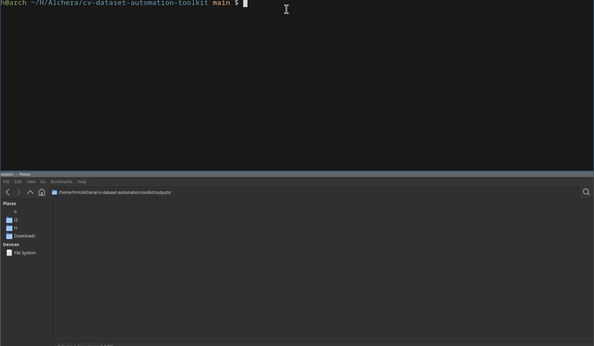

# Computer Vision Dataset Automation Toolkit

CLI-based Python utilities for automating common tasks in computer vision dataset preparation.

This project provides a modular toolkit that helps validate image datasets, clean corrupted or duplicate files, generate metadata, and produce statistical summaries with visualizations.

It demonstrates practical data engineering workflows commonly used in real-world computer vision and machine learning pipelines.

---

## CLI Demo



---

# Key Features

- Image dataset validation
- Automatic dataset cleaning and quarantine
- Exact duplicate detection using SHA256 hashing
- Automated metadata generation for image datasets
- Dataset statistics and visualization generation
- Modular CLI-based utilities
- Structured output directories for reproducible workflows

---

# Project Structure

```
cv-dataset-automation-toolkit
│
├─ src
│  └─ cv_dataset_toolkit
│     ├─ image_validator.py
│     ├─ dataset_cleaner.py
│     ├─ metadata_generator.py
│     ├─ dataset_stats.py
│     │
│     └─ utils
│        ├─ file_utils.py
│        ├─ image_utils.py
│        ├─ logging_utils.py
│        └─ path_utils.py
│
├─ sample_dataset
│  ├─ images
│  └─ annotations
│
├─ outputs
│  ├─ logs
│  ├─ reports
│  ├─ metadata
│  └─ stats
│
├─ quarantine
│  ├─ duplicates
│  └─ invalid
│
├─ requirements.txt
├─ README.md
└─ README_EN.md
```

---

# Dataset Processing Pipeline

The toolkit is designed as a modular pipeline.

```
Raw Dataset
     │
     ▼
image_validator.py
     │
     ▼
validation_report.csv
     │
     ▼
dataset_cleaner.py
     │
     ▼
Clean Dataset
     │
     ▼
metadata_generator.py
     │
     ▼
metadata.csv
     │
     ▼
dataset_stats.py
     │
     ▼
Statistics + Visualizations
```

Each stage can be executed independently depending on the workflow requirements.

---

# Installation

Clone the repository.

```bash
git clone <repository-url>
cd cv-dataset-automation-toolkit
```

Create a virtual environment.

```bash
python -m venv venv
source venv/bin/activate
```

Install dependencies.

```bash
pip install -r requirements.txt
```

---

# Usage

Place dataset images inside:

```
sample_dataset/images
```

---

# 1. Validate Dataset Images

Check image integrity and format support.

```bash
python image_validator.py --input sample_dataset/images
```

Outputs

```
outputs/reports/validation_report.csv
outputs/logs/validation.log
```

The validation report contains information such as:

- file path
- validation status
- resolution
- error type

---

# 2. Clean Dataset

Move corrupted, unsupported, or duplicate files to quarantine.

Example:

```bash
python dataset_cleaner.py \
  --input sample_dataset/images \
  --remove-unsupported \
  --remove-corrupted \
  --deduplicate
```

Outputs

```
quarantine/invalid/
quarantine/duplicates/
outputs/logs/dataset_cleaner.log
```

Duplicate detection is performed using **SHA256 file hashing**, which detects exact duplicate files.

---

# 3. Generate Metadata

Extract image metadata for dataset analysis.

```bash
python metadata_generator.py \
  --input sample_dataset/images \
  --output-json outputs/metadata/metadata.json
```

Outputs

```
outputs/metadata/metadata.csv
outputs/metadata/metadata.json
outputs/logs/metadata_generator.log
```

Metadata includes:

- image width
- image height
- number of channels
- file size
- aspect ratio
- readability status

---

# 4. Generate Dataset Statistics

Generate statistical summaries and visualizations.

```bash
python dataset_stats.py \
  --input-csv outputs/metadata/metadata.csv
```

Outputs

```
outputs/stats/dataset_summary.json

outputs/stats/width_distribution.png
outputs/stats/height_distribution.png
outputs/stats/aspect_ratio_distribution.png
outputs/stats/file_size_distribution.png
outputs/stats/channel_distribution.png
```

These visualizations help analyze dataset properties and distribution.

---

# Output Directory Layout

All generated artifacts are stored in a structured output directory.

```
outputs
├── logs
├── reports
├── metadata
└── stats
```

This structure ensures reproducible dataset processing workflows.

---

# Technologies Used

Core technologies used in this project:

- Python 3
- OpenCV
- pandas
- numpy
- matplotlib
- tqdm

Python standard libraries:

- argparse
- pathlib
- shutil
- hashlib
- logging

---

# Example Use Cases

This toolkit can be useful for:

- Preparing datasets for computer vision training
- Cleaning large image collections
- Generating metadata for dataset inspection
- Detecting duplicate dataset samples
- Understanding dataset characteristics through visualization

---

# Future Improvements

Potential future enhancements include:

- perceptual hashing for near-duplicate image detection
- annotation validation tools
- automatic dataset splitting (train / validation / test)
- parallelized image processing
- support for dataset formats such as COCO or YOLO

---

# License

This project is intended for educational and portfolio purposes.

---

# Author

Computer Vision Dataset Automation Toolkit  
Python-based dataset engineering utilities for machine learning workflows.
